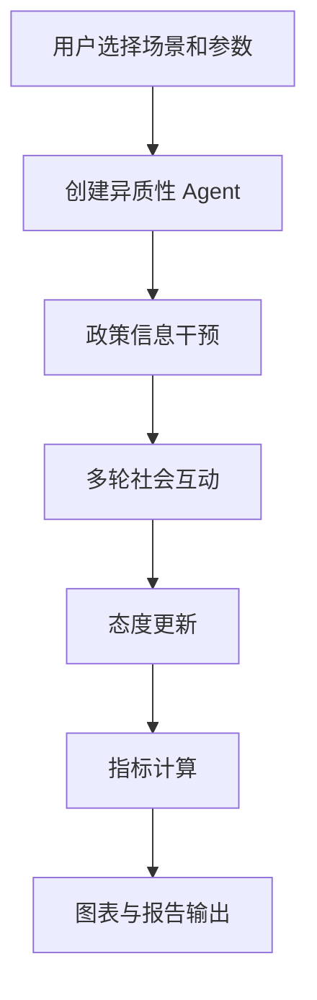

# Architecture

PolicyPulse-Agent 采用轻量级 Streamlit 单体应用结构，不拆分复杂前后端，便于本地运行、课堂展示和 GitHub 浏览。

## Modules
- `app.py`：页面入口、参数交互、结果展示
- `src/models.py`：Pydantic 数据模型
- `src/scenarios.py`：政策场景、干预方式、Agent 模板
- `src/simulator.py`：Agent 创建、邻域互动、态度更新
- `src/metrics.py`：支持率、反对率、中立率、分化程度和沟通效果计算
- `src/charts.py`：Plotly 图表
- `src/report.py`：代表性发言与治理报告
- `src/utils.py`：通用工具函数
- `tests/`：基础测试

## Flow

## Design Notes
- 保持解释性：核心逻辑尽量规则化、可说明
- 保持轻量：不引入数据库、复杂后端框架或部署系统
- 保持一致性：指标集中到 `src/metrics.py`，避免页面、图表和报告各自重复计算
